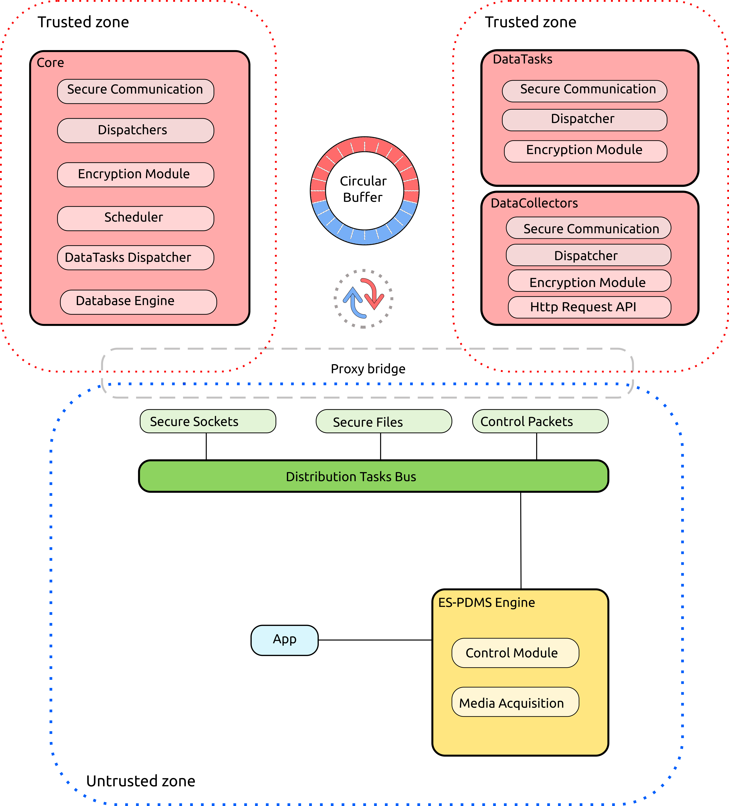

# Concepts

The goal of SGX-ES-PDMS is to provide enclave-orchestration system for automating secure applications deployment and management. 
SGX-ES-PDMS implements a three-layer logical architecture where a minimal Secure Core (**Core**) implements basic operations on personal data, and is extended with Isolated Data Tasks (**Data Tasks**) themselves accessed by Applications (**Apps**) on which no security assumption is made. 
The objective is to control the flow of raw personal data from the Core to the outside, such that only expected results are declassified to untrusted applications or third parties.
The actual implementation focus on two main PDMS functionalities ([References and contributors](references.md)) : the data collection, performed by a **Data Collector** (DC) and the personal computation performed by a **Data Task** (DT).

SGX-ES-PDMS architecture based on Intel SGX is illustrated below.

 
The untrusted part has been implemented fully distributed using ZeroMQ sockets. 

## Engine

### Control Module

The Control Module handles the lifecycle of Enclaves (Core/Data Tasks/Data Collectors). It receives different requests sent by Apps like enclave initialization, datatask execution etc ...  
When a new enclave is initialized, the Control Module dedicates one packet collector (push/pull socket) to it. This will allow an App to transmit requests by registering an acquisition unit (request/reply socket) to this packet collector.

### Media Acquisition (not implemented)

## Distribution Task Bus

Packet collectors are handled by the Distribution Task Bus. It relays packets from Untrusted Zone to the Core and dispatches packets between Enclaves.
Particularly it is responsible for :
1. pushing collected packets emitted by an App to the Core
2. pushing encrypted packets sent by the Core to the targeted enclave (DT/DC)
3. pulling the result of a computation from a Datatask (or collected data from a Data Collector) and pushing it to the Core

Between enclaves (2, 3), communication is carried by secure sockets. A Secure Socket reserves a portion of untrusted memory for two circular buffers : one for incoming and one for outgoing packets.

Encrypted data are exchanged from Core to Data Task or Data Collector only when it has been attested by the Core, and then, a secure channel established using MbedTLS plugin integrated in Open Enclave. The prototype is actually working with RSA and AES encryption.
Each new packet received by the Core is uncapsulated through the FlatBuffers serialization library,  and processed depending of it type, data or control ([Data Computation](dt_workflow.md), [Data Collection](dc_workflow.md)).
