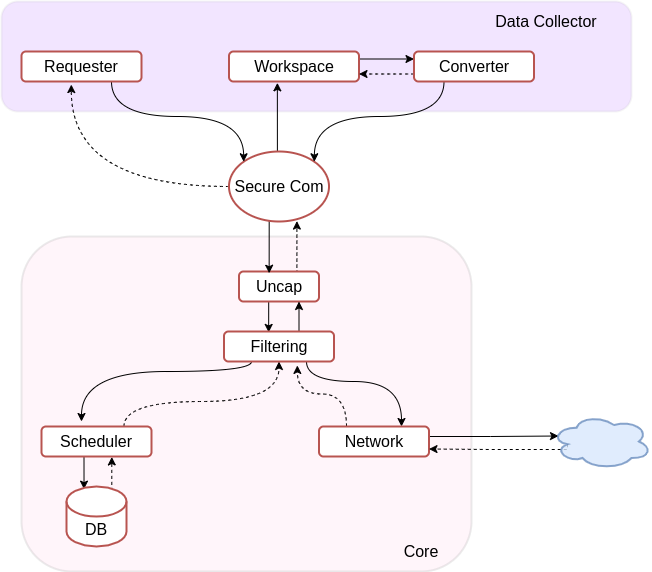

## Data Collection

<u>Workflow</u>
- Data Collector requests the establishment of secure channel with a remote website
- Core processes the request and establishes TLS tunnel
- Data Collector build http request to be relayed to the website via the Core
- Collected data are stored in a dedicated workspace to be processed asynchronously
- Block of data in workspace are converted and submitted to the Core
