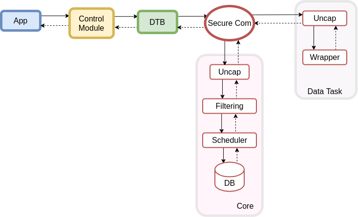

## Data Computation

<u>Workflow</u>
- App sends a control packet
- DTB collects packets and stores them in dedicated buffer to each Enclave
- Core analyzes the request and provides required data from DB
- Core transmits control packets to Data Tasks/Collectors over secure socket
- Wrapper calls the uncapped function with data
- Data Task submits the result to Core over secure socket
- Core stores the intermediate result depending of the scheduler policy
