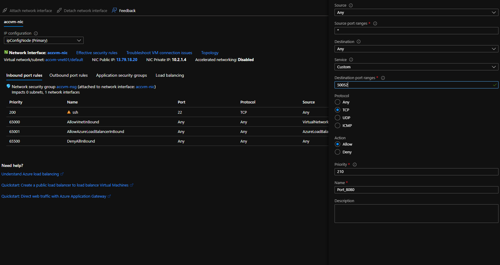

# Azure DCsv2

You can easily deploy BlindAI on [Azure DCsv2 VMs](https://docs.microsoft.com/en-us/azure/virtual-machines/dcv2-series). BlindAI works out of the box, all you need to do is to follow those steps to deploy a VM :&#x20;

### 1 - Create your Azure account (if you don't have already one)

First thing first, you need to create an account on Azure. If you want to try the service for free, it is strongly advised to subscribe [to the free trial.](https://azure.microsoft.com/en-us/free/) Click on the link to have more information.

### 2 - Create the VM

Once you created your account and activated the free credits of $200, you can start searching for `Azure Confidential Computing` and then click on "Create".


After this, you will start to see a configuration screen. Please select either **Ubuntu 18.04 or 20.04. For security reason, it is strongly advised to use a SSH public key in order to use the VM.**


On the next page, you will choose the VM you want to use. We strongly advise you to pick the **DC2s v2 VM** to test BlindAI. Before going to the next page, please remember to **allow the connection from SSH**.


After this screen, please validate and create the VM.


After a few minutes, the VM will be successfully deployed. Before connecting to the VM, **it is strongly advised to set up a DNS name, in order to simplify the connection as much as possible.**


Once you are done with this, we have to **open the ports used by BlindAI.** You need to open the ports **50051 and 50052.**



.png>)

### 3 - Using the VM

You can now start the VM. In order to have a good experience with SSH, we recommand you to download [**Visual Studio Code**](https://code.visualstudio.com/) and get the extension [**Remote - SSH**](https://marketplace.visualstudio.com/items?itemName=ms-vscode-remote.remote-ssh).

Setting up a SSH connection is fairly easy in Visual Studio Code. All you need to do is add a SSH Host (you can find this option in **the Command Palette**):&#x20;


After that, you need to select "Connect to Host" in **the Command Palette** and select your DNS name.


Once you are online, we need to make sure that the SGX drivers are installed. You can do it very easily like this:&#x20;


If you can see "`SGX`" in the list, in the same way it appear on the screenshot above, _<mark style="color:green;">**you're good to go**</mark>_! If `SGX` is missing, you can simply install the drivers yourself with those commands:&#x20;

```
wget https://download.01.org/intel-sgx/sgx-linux/2.15.1/distro/ubuntu18.04-server/sgx_linux_x64_driver_1.41.bin
chmod +x sgx_linux_x64_driver_1.41.bin
./sgx_linux_x64_driver_1.41.bin
```

**If you are getting an error while installing the drivers, it might mean that you picked the wrong VM. Please restart the process in that case.**

If you are good to go, you just need to install Docker on the VM. [Please follow these instructions to get started quickly. ](https://docs.docker.com/engine/install/ubuntu/#install-using-the-repository)

Once Docker is installed, refer to the [deploy-on-hardware.md](../deploy-on-hardware.md "mention") page.
