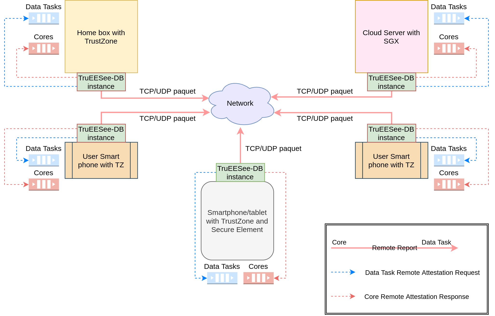

## Inter-enclaves remote attestation architecture for TruEESeE-DB, compatible to physical architecture of an ES-PDMS

The following diagram illustrates the deployment of TruEESeE-DB on Intel SGX and Arm TrustZone, and the mechanism of inter-enclaves attestation using the remote process provided by Open Enclave SDK.

Attestion of Core and Data Tasks enclaves to each other using remote attestations operations